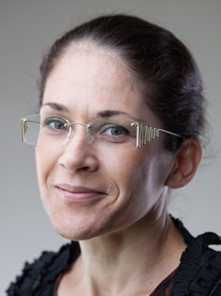
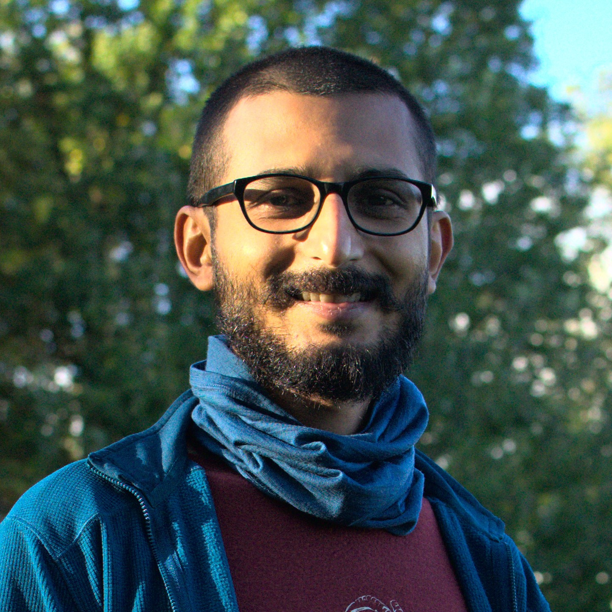

#  Challenges in KDD and ML for Sustainable Development

## Venue
KDD2021 Tutorial Virtual Conference

- Sunday August 15, 12am-3am (Singapore)
- Saturday August 14,  6pm-9pm (Paris)
- Saturday August 14,  12pm-3pm (New York)
- Saturday August 14,  9am-12pm (Los Angeles)

# Summary

Artificial Intelligence and machine learning techniques can offer powerful tools for addressing the greatest challenges facing humanity and helping society adapt to a rapidly changing climate, respond to disasters and pandemic crisis, and ultimately reach the United Nations (UN) Sustainable Development Goals (SDGs) by 2030.  In recent approaches for mitigation and adaptation, data analytics and ML are only one part of the solution that requires interdisciplinary and methodological research and innovations. 
 
 For example, challenges include  multi-modal and multi-source data fusion to combine satellite imagery with other relevant data, 
   handling noisy and missing ground data at various spatio-temporal scales, and ensembling multiple physical and ML models to improve prediction accuracy.  Despite successes, there are many areas where ML is not applicable, performs poorly or gives insights that are not actionable. 
   
 This tutorial will survey the recent and significant contributions in ML across domain areas and scenarios of understanding and promoting sustainable development and we will present cross-cutting approaches and some lessons learned so far. 
Finally, we will highlight current challenges that need to be addressed to transform and better equip engaged sustainability science with robust ML-based tools to support actionable  decision-making. 

# Speakers

### [Laure Berti-Equille](https://pageperso.lis-lab.fr/~laure.berti/) 
{:height="170px" }

Laure is a Research Director in Computer Science at IRD, the French Institute of interdisciplinary Research on Sustainability Science (since 2011) where she leads a research group. Created in 1943, IRD has been working on sustainability research on the field and with close partnerships with the main actors of developing countries.  Before, Laure was a full Professor in CS at Aix-Marseille University (AMU) in France (2017-2018). From 2014-2017, she was a Senior Scientist of Qatar Computing Research Institute. From 2000-2010, she was a tenured Associate Professor in CS at University of Rennes 1 in France, and a 2-years visiting researcher at AT&amp;T Labs Research in New Jersey, USA, as a recipient of the prestigious European Marie Curie Outgoing Fellowship (2007-2009). Her research work is at the intersection of large-scale data analytics and machine learning with a focus on data quality, data cleaning and preparation, and research applied to SDGs supported by many collaborations with industries and more than 80 publications and three monographs.  

### [David Dao](https://daviddao.org/)
{:height="150px" }

David is a PhD student in Computer Science at ETH Zurich and founder of GainForest, a non-profit developing decentralized technology to reverse deforestation with pilot projects in South America and South-East Asia. His research focuses on the deployment of novel machine learning systems for nature and he collaborates with the United Nations and the Government of Chile. His research has been supported by multiple Microsoft AI for Earth grants and fellowships at UC Berkeley and Oasis Labs. David served as co-organizer of the "Tackling Climate Change with ML" workshop at ICLR2020 and the EcoPaDL workshop at ICML2020, as well as the lead organizer for the "Tackling Climate Change with ML" workshop at NeurIPS2020, and is a core member of Climate Change AI, a Global Shaper at World Economic Forum and a Climate Leader at Climate Reality. He is a former researcher at UC Berkeley and Stanford University.

### [Stefano Ermon](https://cs.stanford.edu/~ermon/)
{:height="200px" }

Stefano is an Assistant Professor of Computer Science in the CS Department at Stanford University, where he is affiliated with the Artificial Intelligence Laboratory and a fellow of the Woods Institute for the Environment. His research is centered on techniques for probabilistic modeling of data and is motivated by applications in the emerging field of computational sustainability. He has won several awards, including four Best Paper Awards (AAAI, UAI and CP), a NSF Career Award, ONR and AFOSR Young Investigator Awards, a Sony Faculty Innovation Award, a Hellman Faculty Fellowship, Microsoft Research Fellowship, Sloan Fellowship, and the IJCAI Computers and Thought Award. Stefano earned his Ph.D. in Computer Science at Cornell University in 2015.

### [Bedartha Goswami](https://machineclimate.de/people/goswami/)
{:height="150px" }

Bedartha leads the independent research group "Machine Learning in Climate Science," established in January 2020 within the Cluster of Excellence “Machine Learning” at the University of Tübingen. The group aims to extend and develop machine learning tools and techniques to quantify and unravel complex climate systems. Bedartha has previously worked at the Potsdam Institute for Climate Impact Research (PIK) with Dr. Norbert Marwan and Prof. Dr. Dr. h.c. Jürgen Kurths, and at the Institute of Geosciences, University of Potsdam with Prof. Dr. Bodo Bookhagen. Bedartha is an experienced researcher on uncertainties in climate and paleoclimate data sets, classical statistics, machine learning, nonlinear time series analysis, and complex networks.

# Outline

### Part I (30 mn). Introduction to Data and ML Challenges for Sustainable Development Applications: [[Slides]](part1_tutorial.pdf) and [[Recording]](part1_tutorial.mp4)

The tutorial will start with an introductory overview of the relevant concepts and methods in Data Analytics and Machine Learning applied to Sustainable Development (SD) with a SWOT analysis. We will explore the use of data science and ML techniques as tools to integrate multi-modal, multi-source data and human multidisciplinary expertise. 

We will reformulate a set of SD-related questions into formal ML problem statements and present some illustrative examples and real-world study cases from  various application domains related to climate action, clean and sustainable energy, and biodiversity conservation. We will provide an overview of the opportunities and limitations, alongside with computational, technical, and operational challenges associated with ML applied to sustainability development. 

Next, we will present the main challenges and survey significant   contributions from the literature related to ML applied to SD and articulating the presentation on the following generic pipeline: 
1. Understand  the input and validation data, actors, and the target SD goal; 
2. Collect, integrate, and prepare multi-source and multi-modal data sets; 
3. Select features, ML models/architectures, and parameters; 
4. Include multidisciplinary expertise with  Human-In-the-Loop (HIL) and user interaction; and 
5. Validate and evaluate the actionability, transferability, and reproductibility of the pipeline to other SD settings. 

We  acknowledge that this is a rich topic with numerous interesting and unsolved problems.  However, our goal is to draw attention to a different class of problems that match naturally a core expertise of the KDD community:  analyzing, modeling, enriching, validating, and debugging data to serve an actionable SD goal and sustainability science more broadly. 

To be more specific, the next parts of the tutorial will focus on three specific SDG-related applications of ML: 
1. Exploiting Earth Observation data and satellite imagery to estimate poverty related to SDG#1 No Poverty; 
2. Machine learning based climate data analytics related to SDG#13 Climate Action; and 
3. ML-based monitoring for forest and biodiversity conservation related to SDG#15 Life on Land.

### Part II (40 mn). Using ML and satellite imagery to estimate poverty: [[Slides]](part2_tutorial.pdf) and [[Recording]](part2_tutorial.mp4)

Recent technological developments are creating new data streams that contain a wealth of information relevant to sustainable development goals. Modern AI techniques have the potential to yield accurate, inexpensive, and highly scalable models to inform research and policy. 

A key challenge, however, is the lack of large quantities of labeled data that often characterize successful machine learning applications. 
  We will present new approaches for learning useful spatio-temporal models in contexts where labeled training data is scarce or not available at all. 
 
We will show applications to predict and map poverty in developing countries, monitor agricultural productivity and food security outcomes, and map infrastructure access in Africa. The proposed methods can reliably predict economic well-being using only high-resolution satellite imagery. Because images are passively collected in every corner of the world, the methods can provide timely and accurate measurements in a very scalable end economic way, and could revolutionize efforts towards global poverty eradication.

### Part III (40 mn). ML-based climate data analytics: [[Slides]](part3_tutorial.pdf) and [[Recording]](part3_tutorial.mp4)

Next, we will present an overview of different machine learning based approaches that have been used in climate data analysis. It is divided into two parts: recent climate data analysis and paleoclimate data analysis. 

In the first part, we will look at classical approaches such as principal component analysis (PCA) along with its nonlinear extensions, which include kernel based methods as well as autoencoder based approaches. We will also discuss correlation-based hierarchical clustering as an alternative to PCA for identifying a lower dimensional representation of spatio-temporal climate data sets. This will be followed by an introduction to climate networks, a sparse representation of functional relations between spatially distributed climate time series, and we will look at how climate networks have been used to detect, quantify, and predict complex climate phenomena. 

In the second part, we will introduce the fundamental paradigm of paleoclimate proxy measurements and the challenges that arise due to dating uncertainties. We will present a Bayesian estimation approach of paleo-proxy uncertainties and its numerical approximation. This will allow us to formulate a new representation of time series, as a sequence of probability density functions (PDFs) in lieu of point-like measurements. Finally, we will use the time series as PDF sequence representation to show how recurrence plots can be used to detect abrupt transitions in time series with uncertainties.

### Part IV (30 mn). Utilizing ML to help restore the natural world: [[Slides]](part4_tutorial.pdf) and [[Recording]](part4_tutorial.mp4)

Land use and land use change play a critical role in our climate  taking up about a quarter of annual anthropogenic emissions of greenhouse gases (GHGs) during 2007-2016.  In addition to being a key driver of global warming, careless land use is also destroying valuable ecosystem services and is threatening the livelihood for local populations and a multitude of species. Major conservation and restoration efforts are underway to mitigate and safeguard against these losses, and to highlight the urgency of the issue, 2021-2030 has been declared the “UN Decade on Ecosystem Restoration”. However, we cannot preserve what we cannot measure. Machine learning (ML) plays a significant role in responding to this critical call for action and can accelerate the conservation and sustainable use of our natural world. We will first present the background on the importance of the natural world on climate change and the current biodiversity crisis. Next, we will give an overview of current MRV (monitoring, reporting and verification) pipelines and present a case study of how AI and ML can fit into and scale the existing MRV pipelines.

